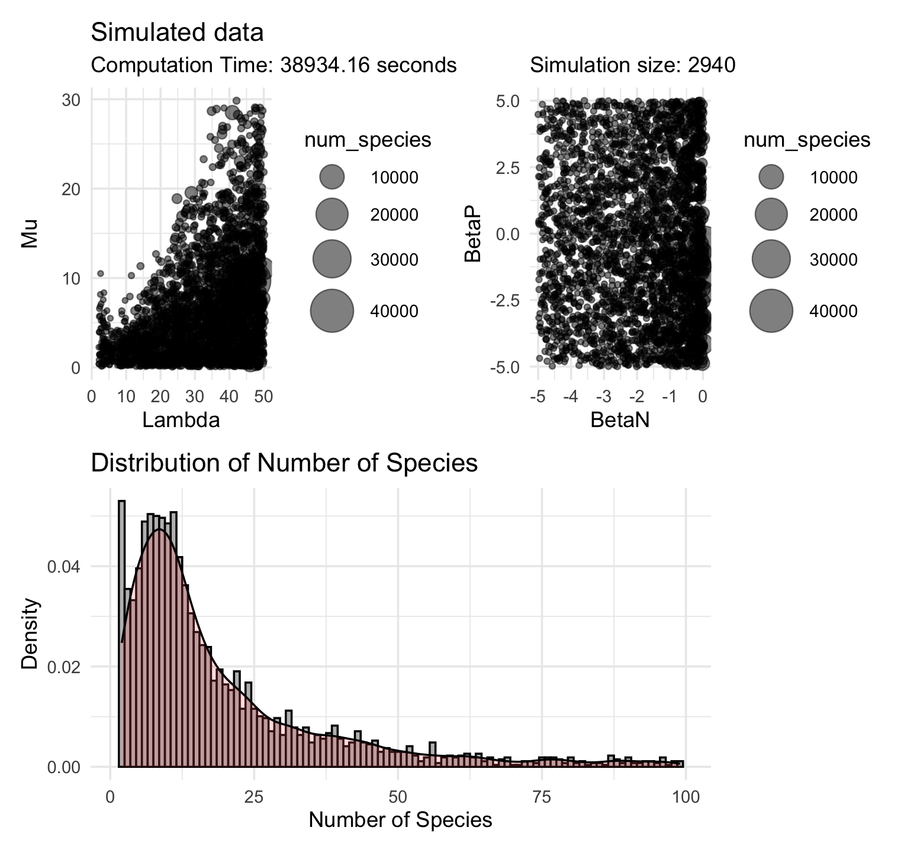

# NNemesis_Build

NNemesis_Build is a specialized R package for constructing and optimizing Neural Networks. It is an offspring of the original NNemesis package, focusing on the creation, training, and fine-tuning of neural networks. The package is designed to simplify the process of building complex neural network models and help users overcome their data science challenges.

## Features

- **Neural Network Creation:** Easily build different types of neural network models with extensive customization options.
- **Training and Optimization:** Comprehensive tools for training your neural network and optimizing its performance.
- **Model Evaluation:** Test and evaluate the performance of your neural network using various metrics.
- **Model Saving and Loading:** Save your trained models for future use or load pre-existing models for further training and evaluation.

## Installation

To install the latest version of NNemesis_Build from GitHub:

```r
# install.packages("devtools")
devtools::install_github("franciscorichter/NNemesis_Build")
```

## Usage

Here is a basic example of how to use NNemesis_Build:

```r
library(NNemesis_Build)
# Define your neural network structure and parameters here
nn_model = build_nn(parameters)
nn_model = train_nn(nn_model, training_data)
evaluate_nn(nn_model, test_data)
```

Please refer to the vignettes for detailed examples and usage instructions.

## License

This project is licensed under the terms of the MIT license.


-------------------------------------------------------------------

## Simulation 


### PD model 




